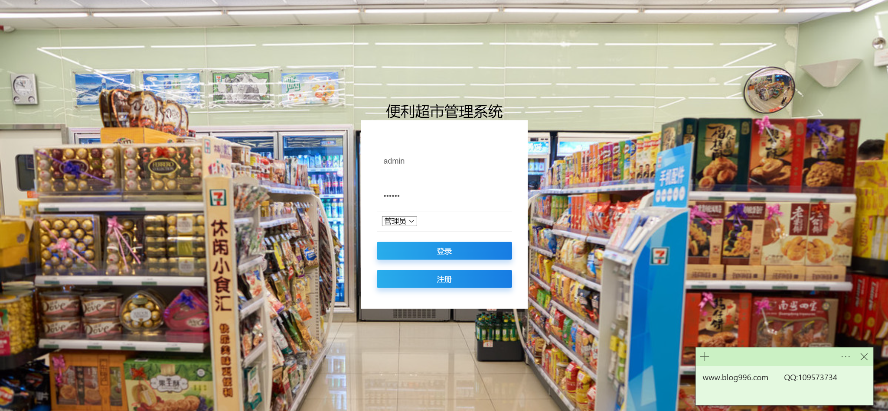
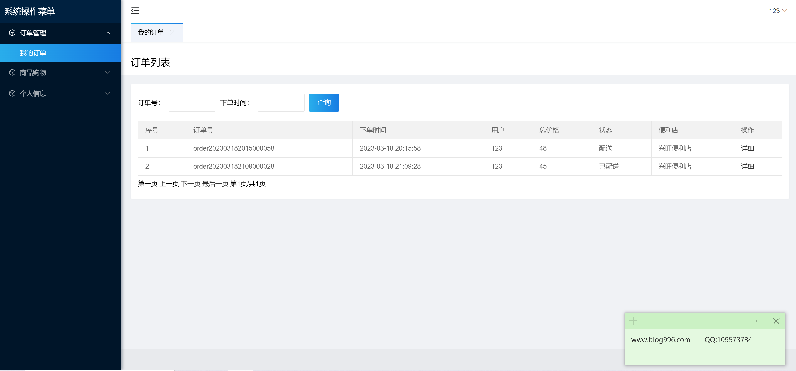
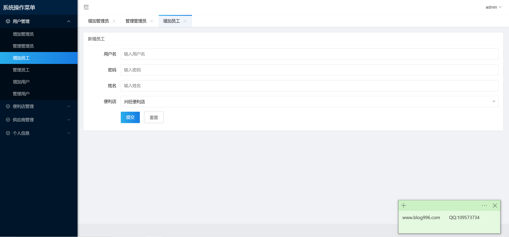
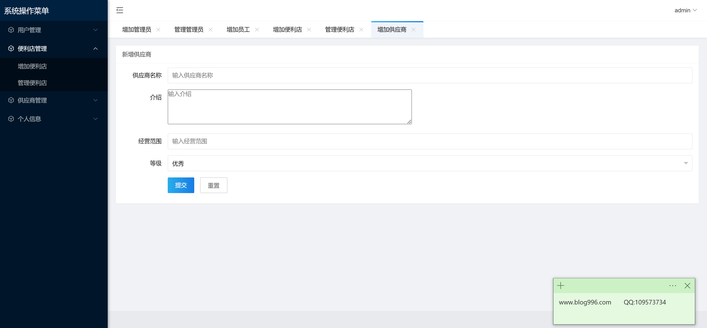
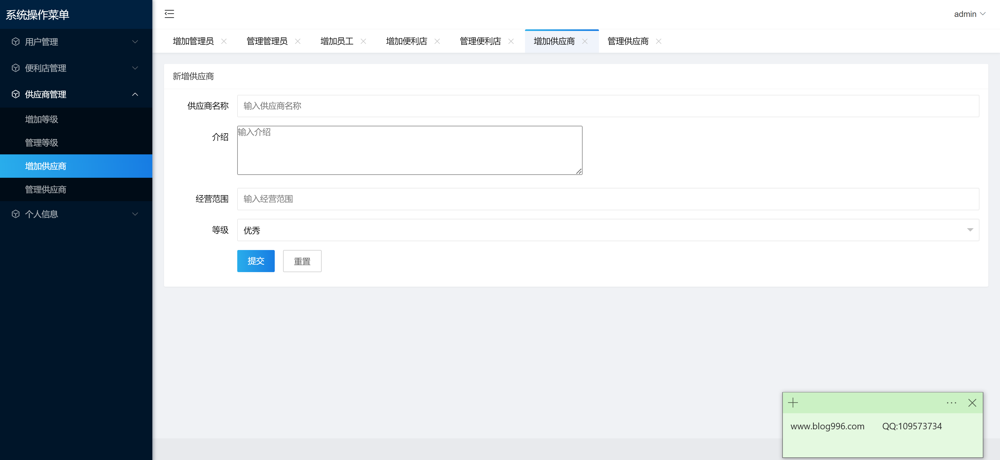
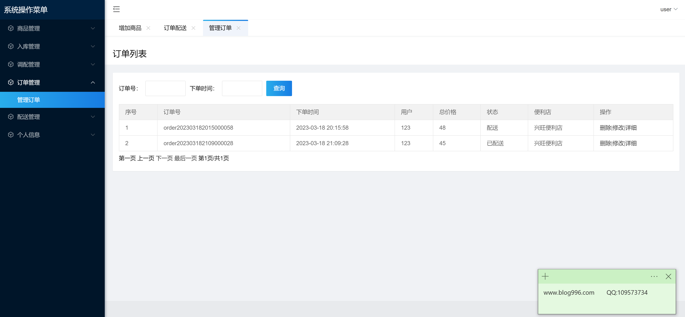
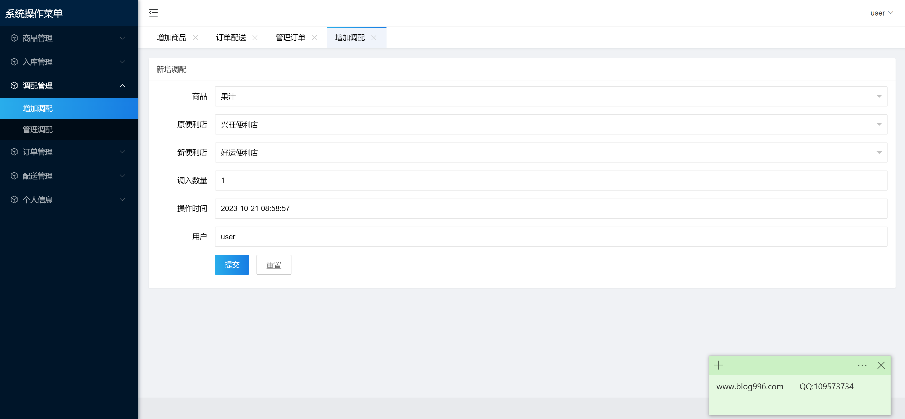
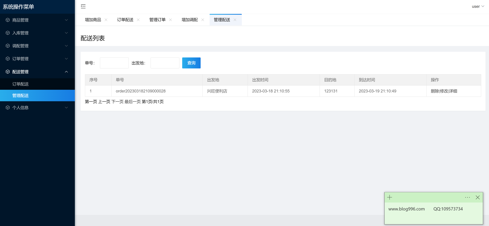

<h1 align="center">便利超市管理系统</h1>

## 简介
便利超市管理系统：角色分为管理员、用户；功能涵盖商品管理、库存监控、销售统计、用户管理，支持供应商添加、新员工信息录入、订单和配送管理等，提升超市运营效率。    --计算机毕业设计源码；毕设源码；java毕业设计源码

## 联系方式

<h3 align="center">获取完整代码与数据库文件 + 微信：bysj5151 QQ: 86050149 QQ群: 783742310</h3>

<h3 align="center">可帮忙远程部署 包运行成功！提供远程部署、修改代码、设计文档指导、代码讲解等服务！</h3>

## 功能介绍（完整见运行截图）
管理员：基本功能包括登录和注册，通过主界面进行供应商、员工、商品和便利店的添加与管理，查看和管理订单，调配商品及配送任务，设定和调整用户权限。配送、库存、销售等关键模块都在管理范围内，支持信息录入、编辑、删除，并提供详细查看功能。用户：注册登录后，能修改个人信息，查看订单状态和历史，管理个人地址和收藏。订单管理允许订单查询和查看详情，页面简洁，支持翻页浏览多页订单。整体界面友好直观，操作简单。

## 运行截图

本代码来源于网络,仅供学习参考使用!

